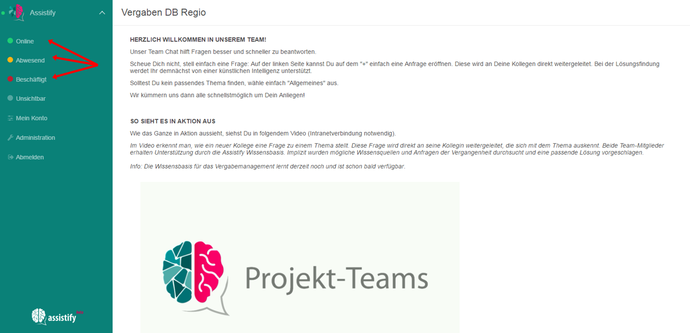

=== Lasse andere wissen, ob Du verfügbar bist

Um andere Benutzer wissen zu lassen, ob du zum Chatten erreichbar bist,
wähle oben links eine Statusoption (Online, Away, Busy) aus. Dazu klicke
zunächst auf deinen Namen oder Avatar und wähle dann einen Status aus.

NOTE: Dein Status wird auf allen Geräten angezeigt, mit denen du
eingeloggt bist. Hast du also den Status „Busy“ gewählt, so erhältst du
auf keinem deiner Geräte Meldungen.

