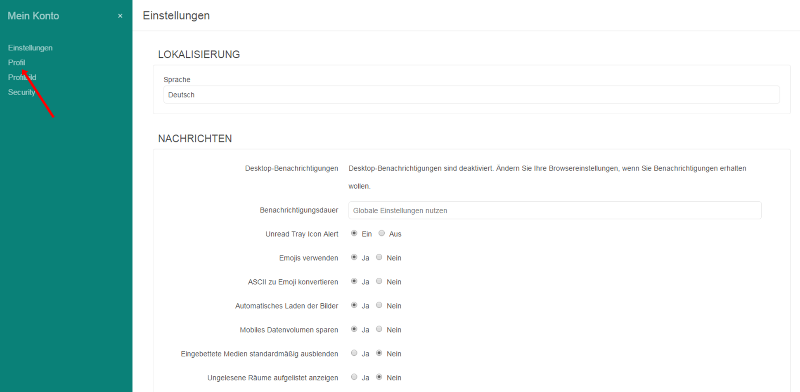

=== Ändere Deinen Benutzernamen oder Dein Passwort

Ändere Dein Benutzername bzw. Dei Passwort einfach, indem Du die folgenden Schritte ausführst:

. Melde Dich mit Deinem Benutzer an Deinem Assistify-Account an

. Klicke auf „Mein Konto“
====

====
. Wähle „Profil“
====

====

. Gib Deinen neuen Benutzernamen / Passwort in das entsprechende Feld ein und klicke auf „Änderungen übernehmen“
====
image:attachments/64964734/64964733.png[]
====
