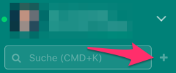
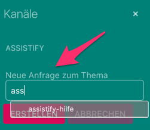
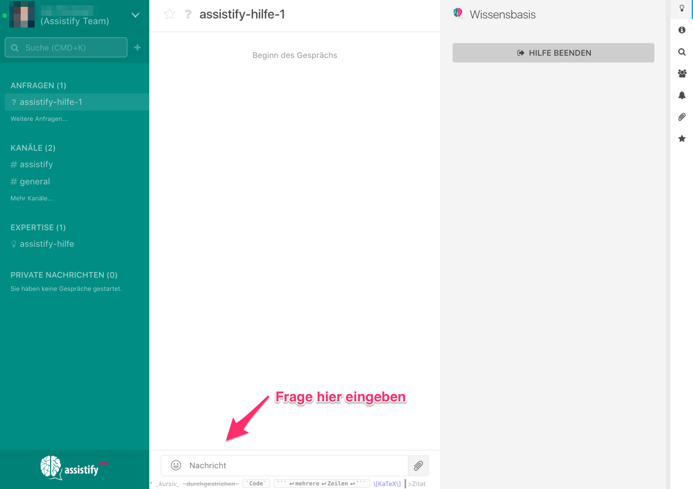
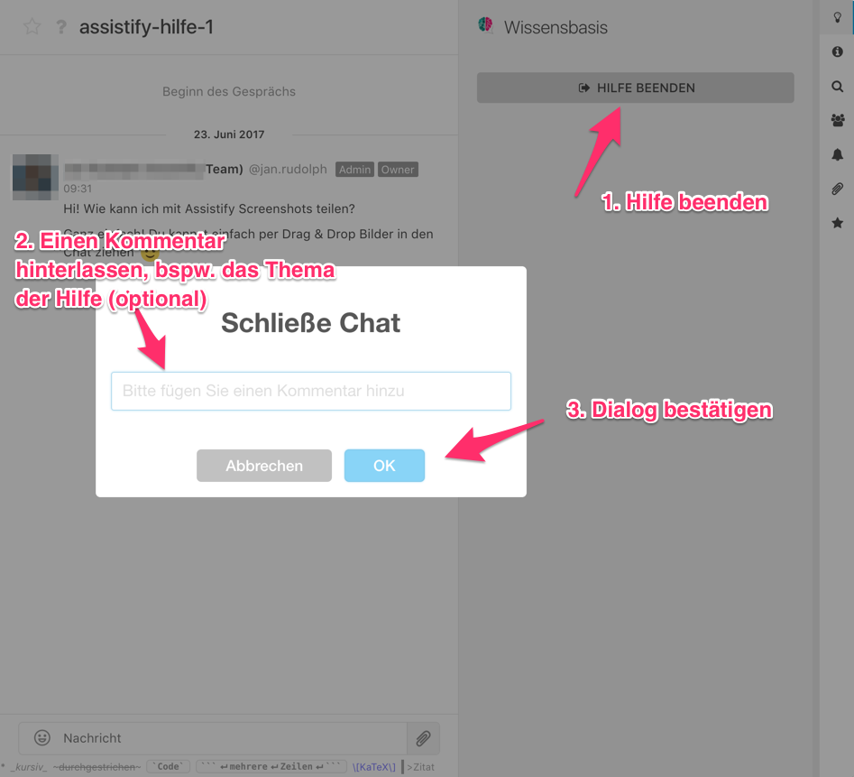

=== Eine neue Anfrage erstellen

Mit Assistify ist es einfach eine Frage an deine Kollegen zu stellen.
Melde dich dafür an und erstelle mit drei Klicks eine Frage, die direkt
an deine Kollegen weitergeleitet wird.

==== Wähle das Plus "+" in der Seitenleiste 

====

====

==== Wähle die passende Kategorie aus
====

====

==== Verfasse deine Frage
====

====

Deine Frage wird nun an deine Kollegen weitergeleitet. Bei einer Antwort
wirst du direkt über den Browser oder via E-Mail benachrichtigt.

==== Trainiere die KI
====

====

Wenn deine Anfrage beantwortet wurde, beende bitte den Chat,
damit die künstliche Intelligenz lernen kann!
