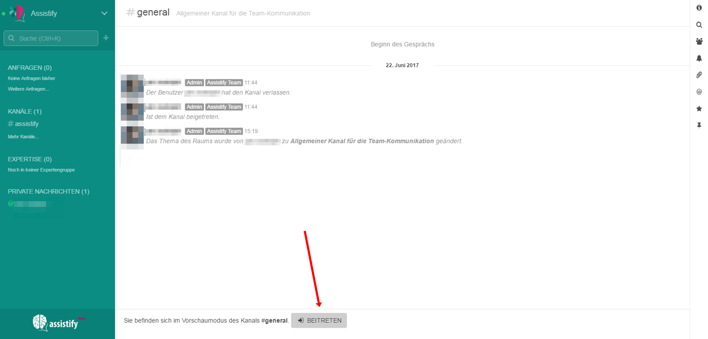

=== Finden und Betreten von Kanälen

==== Kanäle finden

====
 
====

Kanälen, denen du beigetreten bist, werden in der linken Seitenleiste
angezeigt. Um alle Kanäle deiner Community zu sehen, klicke auf "Mehr
Kanäle..." und wähle den von dir gesuchten Kanal aus. Alternativ kannst
du auch nach einem bestimmten Kanal suchen. Gib hierzu einfach in die
Suche oben links den Kanalnamen ein.

==== Kanälen beitreten
====

====

Klicke auf den Kanal, den du suchst, und lass ihn dir so anzeigen.
Klicke dann auf "Beitreten" am unteren Ende der Anzeige, um in den Kanal
einzutreten.
