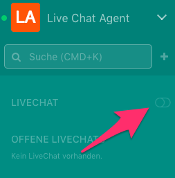
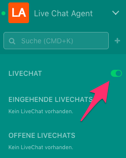
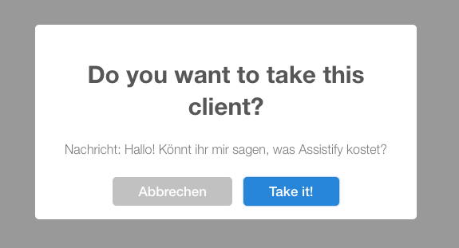
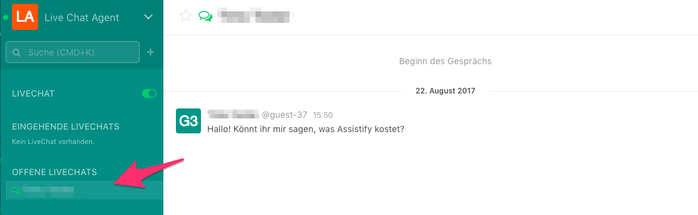
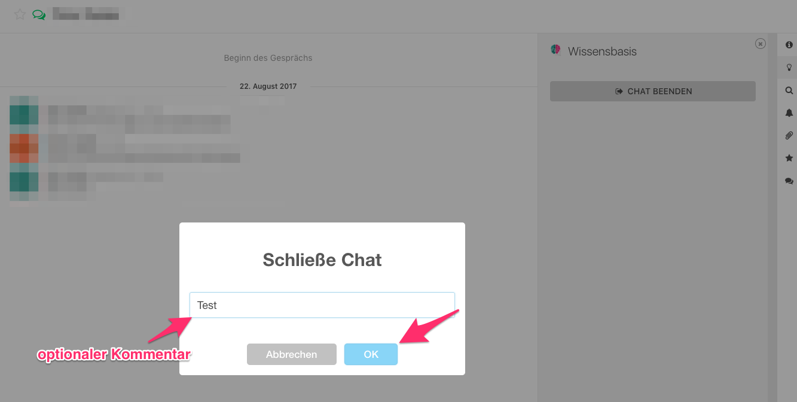

=== Live Chat Anfragen beantworten

Assistify ermöglicht es Live Chat Anfragen von Kunden zu erhalten.
Anfragen können bspw. über ein Website-Plugin eingehen.

==== Voraussetzung für das Empfangen von Live Chat Anfragen
Um Live Chat Anfragen zu erhalten, muss ein Benutzer die Rolle livechat-agent erhalten.
Anschließend kann der Nutzer sich als Agent anmelden.
Dies geschieht, in dem der Nutzer in der linken Spalte den Schalter unter Live Chat aktiviert.

====

====

====

====

==== Eine Anfrage geht ein und ein Agent nimmt diese an
Wenn eine neue Anfrage von einem Kunden eingeht, erscheint diese unter Eingehende Livechats.
Der Agent kann diese nun auswählen und wird gefragt, ob er sie annehmen möchte.

====
image:attachments/68240530/68240544.png[]
====

====

====

Die angenommene Anfrage erscheint in der linken Spalte unter Offene Livechats.
Nun ist es möglich wie in jedem anderen Kanal auch Nachrichten auszutauschen.

====

====

==== Anfrage abschließen
Ist das Anliegen des Kunden abgeschlossen, sollte der Chat geschlossen werden.
Hierfür muss in der rechten Seitenleiste einfach auf Chat beenden geklickt werden.
Im Folgenden Dialog kann optional noch ein Kommentar angegeben werden, bspw. für eine Kategorisierung der Anfrage.

====
image:attachments/68240530/68240588.png[]
====

====

====
