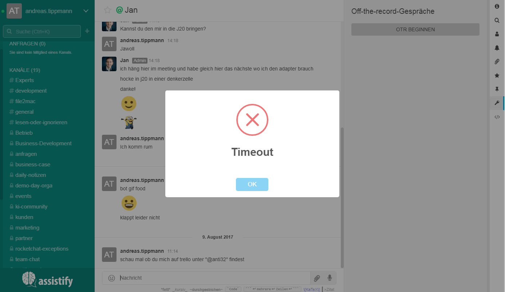

=== Off-the-record Gespräche

==== So flüstern Sie ...

====

Du kannst deine Direktnachrichten absichern, indem Du Off-the-record
(OTR) aktivierst. Wenn Du in einem Privatchat bist, dann wähle das
Schlüssel-Symbol in der rechten Navigationsleiste.

[TIP]
image:attachments/68231861/68231846.png[]

NOTE: Wenn Du dich in einem OTR-Chat befindest, dann haben die Nachrichten ein
Schlüsselsymbol und werden verschlüsselt versendet. Nachdem die OTR
Konversation beendet wurde, werden die verschlüsselten Nachrichten
automatisch gelöscht (Manchmal muss dazu die Seite aktualisiert werden).

IMPORTANT: Der Empfänger einer OTR-Anfrage muss bestätigen, dass er an der
verschlüsselten Konversation teilnehmen muss.

====

==== Bekannte Probleme mit dem Internet-Explorer

====

Die OTR-Konversation funktioniert derzeit nicht im Internet Explorer.
[CAUTION]

====
