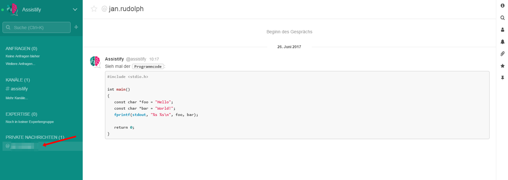
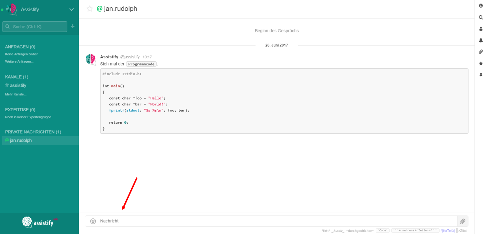

=== Private Nachrichten

Private Nachrichten sind Konversationen zwischen zwei Benutzern. Sie
sind der schnellste Weg, um die Aufmerksamkeit anderer Teammitglieder zu
bekommen. Wenn du also schnell mit jemandem chatten möchtest, ohne dass
deine Konversationen in einem größeren Raum verloren geht, dann springe
einfach in eine private Nachricht.

==== Öffnen existierender Direktnachrichten

Deine offenen privaten Nachrichten werden links in der Seitenleiste
aufgelistet. Wenn du eine davon ausblenden willst, navigiere deine Maus
über den Namen und klicke auf das Augensymbol.

==== Verfassen einer neuen privaten Nachricht

image:attachments/64964843/64964834.png[]

Keine Sorge, durch das Ausblenden einer Konversation wird diese nicht
gelöscht. Wenn du erst auf das Profil des Benutzers klickst, siehst du
einen Button „Konversation“, um zur Privatnachricht zu springen.
Gleichzeitig wird so die Konversation wieder zur linken Seitenleiste
hinzugefügt.

==== Schreiben von privaten Nachrichten

Bist du erst einmal in einer Konversation einer Privatnachricht, wirst
du feststellen, dass das Interface genauso aussieht wie an anderen
Stellen in der Anwendung. Du kannst zum Schreiben einer Nachricht das
Textfeld am unteren Rand des Fensters benutzen.
