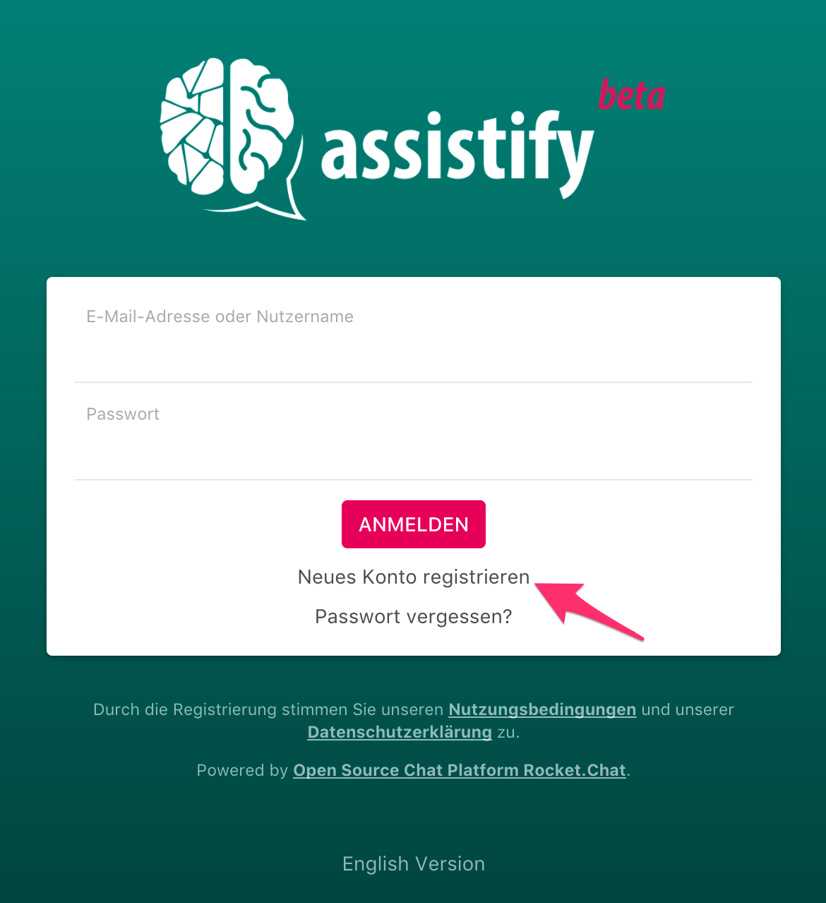
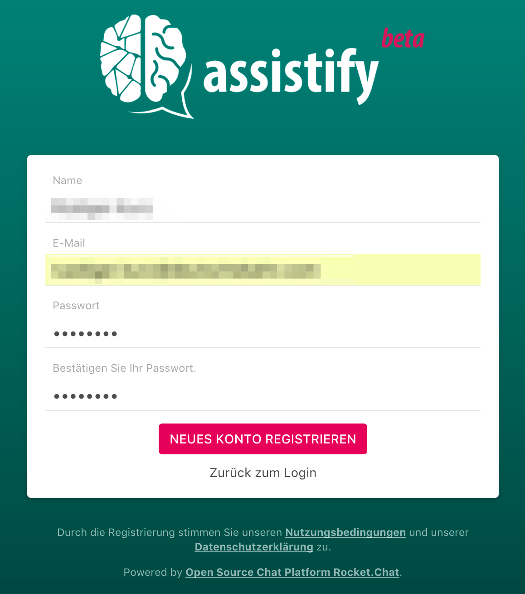
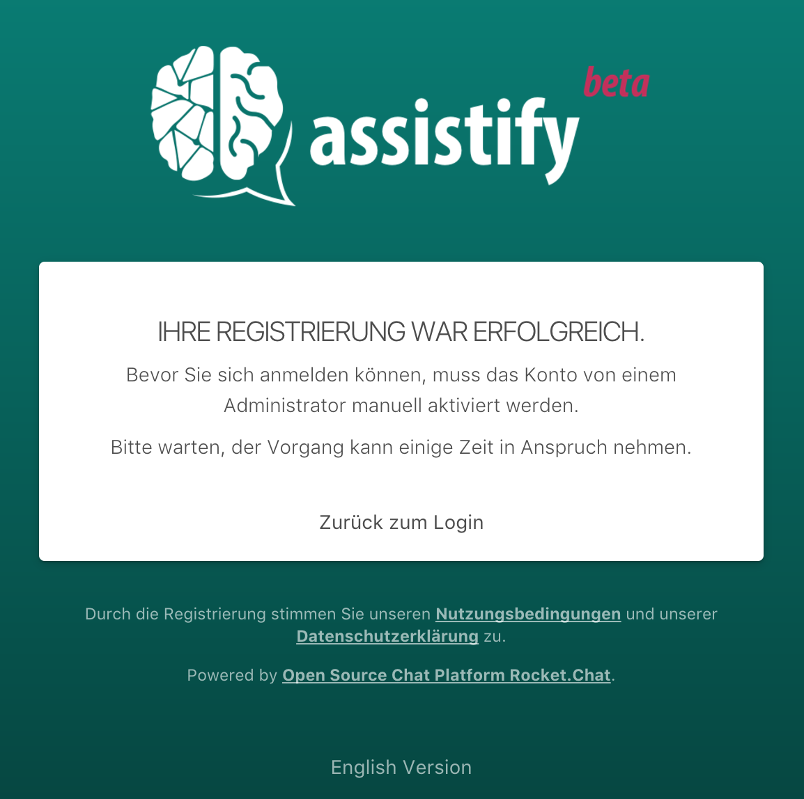

=== Registriere Deinen Benutzer

==== Auf der Startseite von Assistify den Link "Neues Konto registrieren" klicken

====

====

==== Formular ausfüllen und absenden
====

====

==== Information zur Bestätigung
====

====

[TIP]
====

*Keine automatischen Benachrichtigungen*

Derzeit versendet das System keine automatische Nachricht an den
fachlichen Administrator, wenn sich ein neuer Benutzer registriert.

Wir empfehlen daher nach der Registrierung direkt auf den
Fachadministrator zuzugehen und ihn um Aktivierung des Benutzers zu
bitten.

Siehe dazu auch
link:Benutzer-aktivieren_64963739.html[Benutzeraktivieren].
Hier wird erklärt, was der Fachadministrator tun muss, um ein Benutzerkonto zu aktivieren.

====
