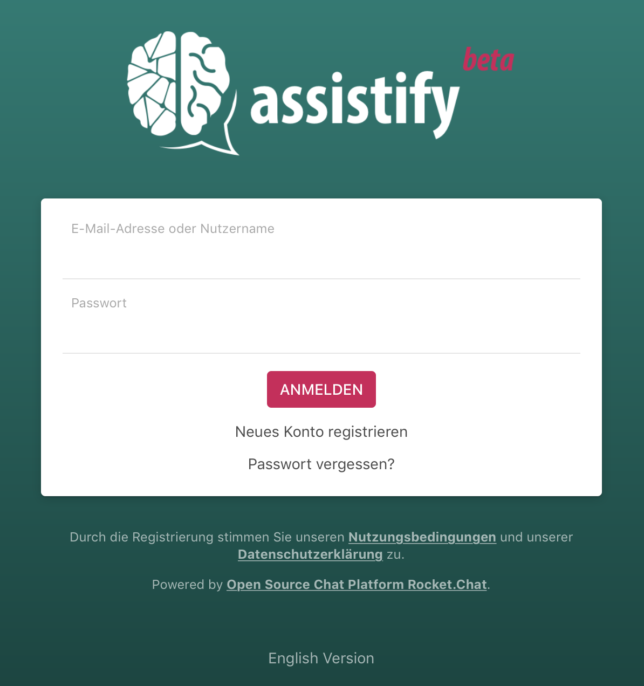
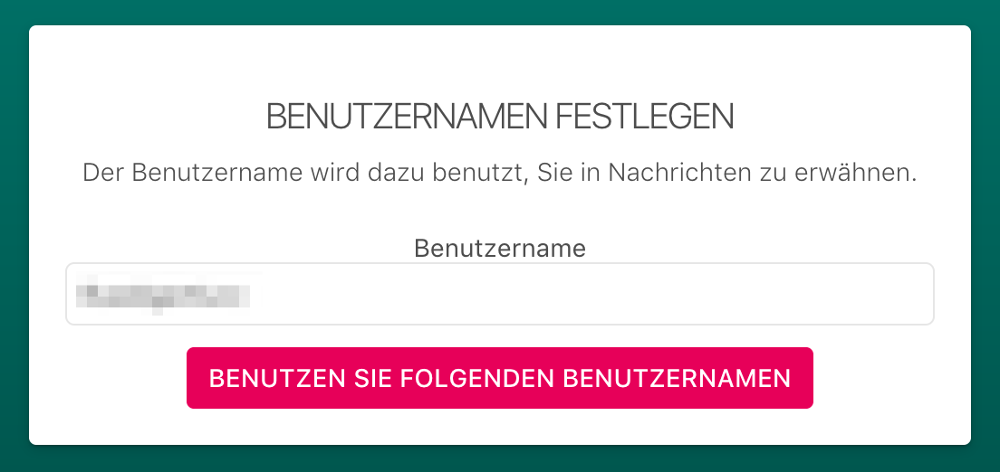
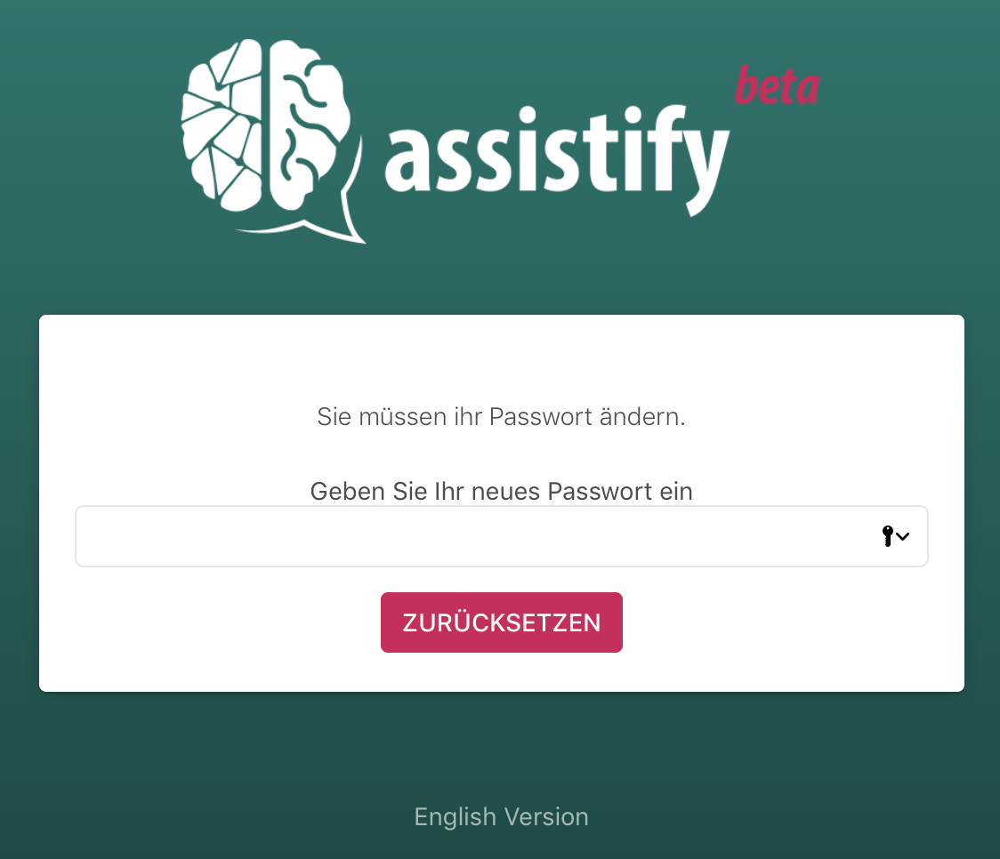
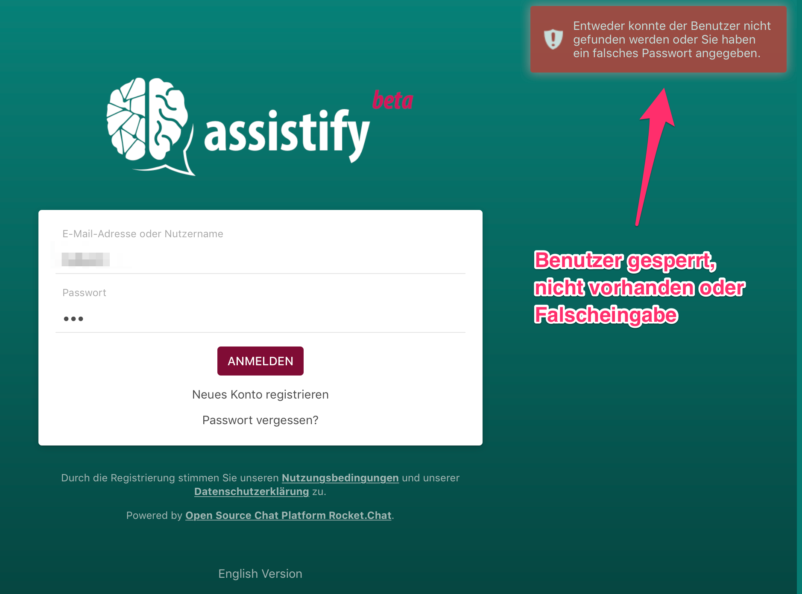

=== Melde Dich an Assistify an

In diesem Abschnitt wird beschrieben, wie Sie sich an Assistify
anmelden. Je nach dem, ob Sie bereits ein Benutzerkonto haben, dieses
per Selbstregistrierung angelegt wurde oder von einem Administrator,
werden Sie aufgefordert Ihren Benutzernamen festzulegen bzw. Ihr
Passwort zu vergeben.

[TIP]
====
*Startseite / Anmeldeseite*

Begeben Sie sich auf die Startseite (URL) von Assistify.

* Sollte Ihnen die Startseite (URL) nicht bekannt sein, erfragen Sie
diese bei Ihrem Fachdienst bzw. bei ihrem fachlichen Administrator.

* Sollten Sie kein Benutzerkonto haben, können Sie sich einfach selbst
registrieren. Lesen Sie hierzu das Kapitel
<<assistify-self-registration.adoc#, Selbstregistrierung>>

* Sollte Ihr Bereich keinen Account bei Assistify haben sprechen Sie uns
einfach an info@assistify.de
====

==== Anmeldeformular (vorhandener / aktiver Benutzer)
====

====

==== Erstanmeldung nach Selbstregistrierung
====

====

==== Erstanmeldung nach Einladung durch Administrator
====

====

==== Gesperrtes, gelöschtes oder nicht vorhandenes Benutzerkonto
====

====

[TIP]
====
*Noch nicht aktiviert?*

Wenn Sie sich sicher sind, dass Sie ihren Benutzernamen und das Passwort
richtig eingegeben haben und fester Überzeugung sind, dass Sie ein
Benutzerkonto besitzen, aber sich dennoch nicht anmelden können, wenden
Sie sich bitte an Ihren fachlichen Administrator. Sollte Ihnen der Name
dieser Person nicht bekannt sein, wenden Sie sich gerne auch direkt an
das Assistify Team unter info@assistify.de - Wir helfen gerne weiter!

====
